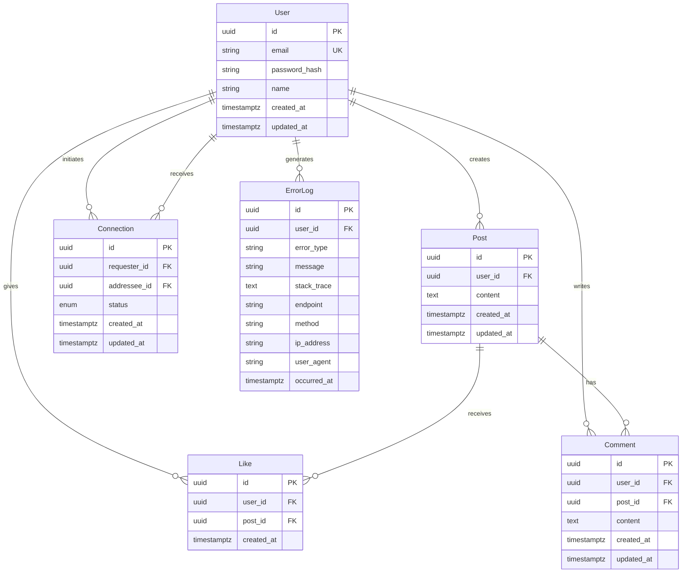

# Data Model: Social Media REST API

**Date**: 2025-10-05
**Feature**: 002-build-an-rest
**Storage**: PostgreSQL with immediate consistency
**Enhanced**: Migration and seed data support

## Entity Relationships



## Entity Definitions

### User
**Purpose**: Represents a registered user in the social media system
**Key Attributes**:
- `id`: UUID primary key
- `email`: Unique email address for authentication
- `password_hash`: Bcrypt-hashed password (never store plain text)
- `name`: Display name for the user
- `created_at`: Account creation timestamp
- `updated_at`: Last update timestamp

**Validation Rules**:
- Email must be valid format and unique
- Password must be >= 8 characters when set
- Name must be 1-100 characters
- All timestamps are UTC

**State Transitions**:
- `pending` → `active` (via email verification if implemented)
- `active` → `suspended` (admin action)
- `suspended` → `active` (admin action)

### Post
**Purpose**: Represents content created by users
**Key Attributes**:
- `id`: UUID primary key
- `user_id`: Foreign key to User who created the post
- `content`: Text content of the post
- `created_at`: Post creation timestamp
- `updated_at`: Last edit timestamp

**Validation Rules**:
- Content must be 1-2000 characters
- User must exist and be active
- All timestamps are UTC

**Business Rules**:
- Users can only edit their own posts
- Posts are visible to user's connections only
- Posts cannot be deleted if they have likes/comments (soft delete)

### Connection
**Purpose**: Represents relationships between users
**Key Attributes**:
- `id`: UUID primary key
- `requester_id`: Foreign key to User who initiated connection
- `addressee_id`: Foreign key to User who received connection request
- `status`: Connection status (pending, accepted, blocked)
- `created_at`: Request creation timestamp
- `updated_at`: Last status change timestamp

**Validation Rules**:
- Cannot connect to self
- Only one connection per user pair
- All timestamps are UTC

**State Transitions**:
- `pending` → `accepted` (addressee accepts request)
- `pending` → `blocked` (addressee blocks requester)
- `accepted` → `blocked` (either user blocks the other)
- `blocked` → `accepted` (unblock action)

### Like
**Purpose**: Represents user's positive reaction to posts
**Key Attributes**:
- `id`: UUID primary key
- `user_id`: Foreign key to User who gave the like
- `post_id`: Foreign key to Post that was liked
- `created_at`: Like creation timestamp

**Validation Rules**:
- User cannot like their own post
- User can only like a post once
- Post must exist and be visible
- Timestamp is UTC

**Business Rules**:
- Likes can be toggled (unliking removes the record)
- Like count affects post visibility algorithms

### Comment
**Purpose**: Represents user responses to posts
**Key Attributes**:
- `id`: UUID primary key
- `user_id`: Foreign key to User who wrote the comment
- `post_id`: Foreign key to Post being commented on
- `content`: Text content of the comment
- `created_at`: Comment creation timestamp
- `updated_at`: Last edit timestamp

**Validation Rules**:
- Content must be 1-1000 characters
- User must be connected to post author
- Post must exist and be visible
- All timestamps are UTC

**Business Rules**:
- Users can only edit their own comments
- Comments cannot be deleted if they have replies
- Comments inherit visibility from parent post

### ErrorLog
**Purpose**: Stores error logs for debugging and monitoring as required by the constitution
**Key Attributes**:
- `id`: UUID primary key
- `user_id`: Foreign key to User who encountered the error (nullable for system errors)
- `error_type`: Type/category of error (authentication, validation, database, etc.)
- `message`: Human-readable error message
- `stack_trace`: Full stack trace for debugging (stored as text)
- `endpoint`: API endpoint where error occurred
- `method`: HTTP method (GET, POST, PUT, DELETE)
- `ip_address`: Client IP address for security tracking
- `user_agent`: Client user agent string
- `occurred_at`: Timestamp when error occurred

**Validation Rules**:
- Error type must be predefined category
- Message must be 1-1000 characters
- Stack trace can be up to 10000 characters
- Endpoint must be valid path format
- Method must be valid HTTP method
- IP address must be valid IPv4/IPv6 format
- Timestamp is UTC

**Business Rules**:
- All error conditions are logged per constitutional requirement
- System errors (no user_id) are logged separately
- Sensitive data is filtered from stack traces
- Logs are batch-processed every hour as per constitution
- Historical logs are archived after 90 days
- PII in logs is masked for privacy compliance

## Database Constraints

### Primary Keys
All tables use UUID primary keys for:
- Global uniqueness across distributed systems
- No sequential ID exposure
- Better sharding potential

### Foreign Keys
- All foreign keys reference valid records (RESTRICT)
- Cascading deletes handled at application level
- Connection cycles prevented by application logic

### Indexes
Performance-optimized indexes for common queries:
- `users(email)` - Unique login lookup
- `posts(user_id, created_at)` - User feed queries
- `posts(created_at)` - Global feed queries
- `connections(requester_id, status)` - User connections
- `connections(addressee_id, status)` - Received requests
- `likes(post_id)` - Like counts
- `comments(post_id, created_at)` - Post comments
- `error_logs(occurred_at)` - Time-based log queries
- `error_logs(error_type, occurred_at)` - Error type filtering
- `error_logs(user_id, occurred_at)` - User-specific error history

### Constraints
- Unique constraints prevent duplicates
- Check constraints validate data integrity
- Not null constraints ensure required data

## Data Integrity Rules

### Consistency Requirements
- Immediate consistency per specification
- All mutations transactional
- Referential integrity maintained

### Business Logic Constraints
- Users can only see posts from accepted connections
- Connection requests are one-way until accepted
- Like counts are accurate at all times
- Comment threads maintain chronological order

### Security Considerations
- Password hashes never exposed
- User enumeration prevented on endpoints
- Rate limiting on sensitive operations
- Audit trails for all data modifications

## Migration Strategy

### Migration Management
- **Location**: `/internal/infrastructure/database/migrations/`
- **Format**: SQL files with version numbering (001_..., 002_...)
- **Features**:
  - Up and down migrations
  - Version tracking with migration history table
  - Automatic dependency resolution
  - Rollback capabilities

### Migration Files Structure
```
migrations/
├── 001_create_users_table.up.sql
├── 001_create_users_table.down.sql
├── 002_create_posts_table.up.sql
├── 002_create_posts_table.down.sql
├── 003_create_connections_table.up.sql
├── 003_create_connections_table.down.sql
├── 004_create_likes_table.up.sql
├── 004_create_likes_table.down.sql
├── 005_create_comments_table.up.sql
├── 005_create_comments_table.down.sql
├── 006_create_error_logs_table.up.sql
├── 006_create_error_logs_table.down.sql
└── 007_add_constraints_and_indexes.up.sql
    └── 007_add_constraints_and_indexes.down.sql
```

### Migration Command Interface
- **Up Migrations**: Apply pending migrations in order
- **Down Migrations**: Rollback specific number of migrations
- **Status**: Show current migration version and pending migrations
- **Create**: Generate new migration file templates

## Seed Data Strategy

### Seed Data Management
- **Location**: `/internal/infrastructure/database/seed/`
- **Purpose**: Development and testing environment setup
- **Features**:
  - Configurable data volumes
  - Realistic dummy data generation
  - Relationship-aware data creation
  - Idempotent operations

### Seed Data Structure
```
seed/
├── users.json              # User account definitions
├── posts.json              # Post content templates
├── connections.json        # Connection relationship patterns
├── seed.go                 # Seed data generation logic
└── README.md               # Seed data usage instructions
```

### Seed Data Features
- **User Generation**: Create realistic user profiles with varied names, emails
- **Content Generation**: Generate meaningful post and comment content
- **Relationship Creation**: Establish connections, likes, and comments between users
- **Environment-Specific**: Different seed sets for development vs testing

### Seed Data Command Interface
- **Run**: Execute seed data generation
- **Reset**: Clear all seed data
- **Validate**: Verify seed data integrity
- **Custom**: Apply specific seed data scenarios

## Repository Interface Examples

```go
// MigrationRepository interface for database migration management
type MigrationRepository interface {
    GetCurrentVersion() (int, error)
    SetVersion(version int) error
    CreateMigrationTable() error
}

// SeedRepository interface for seed data management
type SeedRepository interface {
    SeedUsers(count int) error
    SeedPosts(postsPerUser int) error
    SeedConnections(connectionsPerUser int) error
    SeedLikes(likesPerPost int) error
    SeedComments(commentsPerPost int) error
    ClearAllSeedData() error
}

// ErrorLogRepository interface for error log management
type ErrorLogRepository interface {
    LogError(error *ErrorLog) error
    GetErrorsByUser(userID uuid.UUID, limit int, offset int) ([]*ErrorLog, error)
    GetErrorsByType(errorType string, limit int, offset int) ([]*ErrorLog, error)
    GetErrorsByTimeRange(start, end time.Time, limit int, offset int) ([]*ErrorLog, error)
    ArchiveOldErrors(beforeDate time.Time) (int, error)
    GetErrorStatistics(timeRange time.Time) (map[string]int, error)
}
```

This enhanced data model provides comprehensive support for both application data management and development workflow automation through migration and seed data functionality.