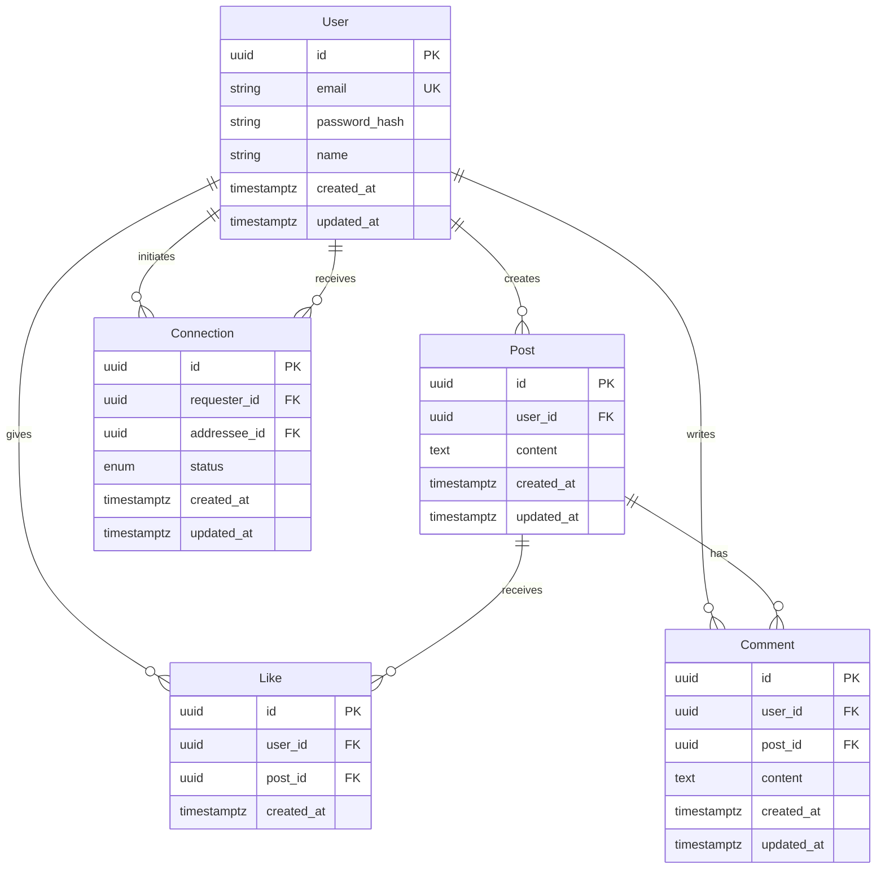

# Data Model: Social Media API

**Date**: 2025-10-05
**Storage**: PostgreSQL with immediate consistency

## Entity Relationships

## Entity Definitions

### User
**Purpose**: Represents a registered user in the social media system
**Key Attributes**:
- `id`: UUID primary key
- `email`: Unique email address for authentication
- `password_hash`: Bcrypt-hashed password (never store plain text)
- `name`: Display name for the user
- `created_at`: Account creation timestamp
- `updated_at`: Last update timestamp

**Validation Rules**:
- Email must be valid format and unique
- Password must be >= 8 characters when set
- Name must be 1-100 characters
- All timestamps are UTC

**State Transitions**:
- `pending` → `active` (via email verification if implemented)
- `active` → `suspended` (admin action)
- `suspended` → `active` (admin action)

### Post
**Purpose**: Represents content created by users
**Key Attributes**:
- `id`: UUID primary key
- `user_id`: Foreign key to User who created the post
- `content`: Text content of the post
- `created_at`: Post creation timestamp
- `updated_at`: Last edit timestamp

**Validation Rules**:
- Content must be 1-2000 characters
- User must exist and be active
- All timestamps are UTC

**Business Rules**:
- Users can only edit their own posts
- Posts are visible to user's connections only
- Posts cannot be deleted if they have likes/comments (soft delete)

### Connection
**Purpose**: Represents relationships between users
**Key Attributes**:
- `id`: UUID primary key
- `requester_id`: Foreign key to User who initiated connection
- `addressee_id`: Foreign key to User who received connection request
- `status`: Connection status (pending, accepted, blocked)
- `created_at`: Request creation timestamp
- `updated_at`: Last status change timestamp

**Validation Rules**:
- Cannot connect to self
- Only one connection per user pair
- All timestamps are UTC

**State Transitions**:
- `pending` → `accepted` (addressee accepts request)
- `pending` → `blocked` (addressee blocks requester)
- `accepted` → `blocked` (either user blocks the other)
- `blocked` → `accepted` (unblock action)

### Like
**Purpose**: Represents user's positive reaction to posts
**Key Attributes**:
- `id`: UUID primary key
- `user_id`: Foreign key to User who gave the like
- `post_id`: Foreign key to Post that was liked
- `created_at`: Like creation timestamp

**Validation Rules**:
- User cannot like their own post
- User can only like a post once
- Post must exist and be visible
- Timestamp is UTC

**Business Rules**:
- Likes can be toggled (unliking removes the record)
- Like count affects post visibility algorithms

### Comment
**Purpose**: Represents user responses to posts
**Key Attributes**:
- `id`: UUID primary key
- `user_id`: Foreign key to User who wrote the comment
- `post_id`: Foreign key to Post being commented on
- `content`: Text content of the comment
- `created_at`: Comment creation timestamp
- `updated_at`: Last edit timestamp

**Validation Rules**:
- Content must be 1-1000 characters
- User must be connected to post author
- Post must exist and be visible
- All timestamps are UTC

**Business Rules**:
- Users can only edit their own comments
- Comments cannot be deleted if they have replies
- Comments inherit visibility from parent post

## Database Constraints

### Primary Keys
All tables use UUID primary keys for:
- Global uniqueness across distributed systems
- No sequential ID exposure
- Better sharding potential

### Foreign Keys
- All foreign keys reference valid records (RESTRICT)
- Cascading deletes handled at application level
- Connection cycles prevented by application logic

### Indexes
Performance-optimized indexes for common queries:
- `users(email)` - Unique login lookup
- `posts(user_id, created_at)` - User feed queries
- `posts(created_at)` - Global feed queries
- `connections(requester_id, status)` - User connections
- `connections(addressee_id, status)` - Received requests
- `likes(post_id)` - Like counts
- `comments(post_id, created_at)` - Post comments

### Constraints
- Unique constraints prevent duplicates
- Check constraints validate data integrity
- Not null constraints ensure required data

## Data Integrity Rules

### Consistency Requirements
- Immediate consistency per specification
- All mutations transactional
- Referential integrity maintained

### Business Logic Constraints
- Users can only see posts from accepted connections
- Connection requests are one-way until accepted
- Like counts are accurate at all times
- Comment threads maintain chronological order

### Security Considerations
- Password hashes never exposed
- User enumeration prevented on endpoints
- Rate limiting on sensitive operations
- Audit trails for all data modifications